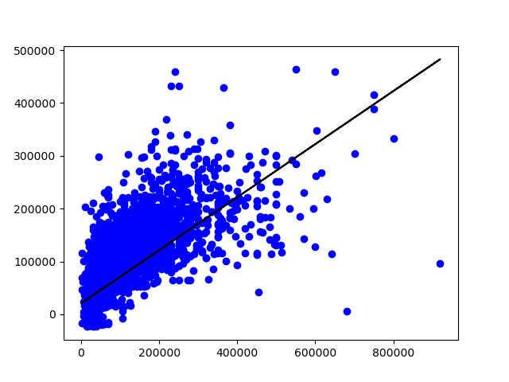

# CS4641 Midterm Report: House Price Predictor

## Team Members

- Meena Ajith
- Srajan Sunil Dube
- Roshen Jegajeevan
- Nilesh Manivannan
- Austin Peng

## Introduction/Background

Various factors affect the prices of houses in any location. Without a proper way to determine the effect of those factors, it is impossible to find out the best time to purchase a house, which is obviously at the lowest value possible. Many studies analyzed housing factors and long-term changes. However, these studies have been completed mainly in the US and Europe, examining developed countries in a capitalistic economy. Our project will aim to analyze the housing market of an untapped area such as Georgia (the country, not the state). Georgia ranks 100th in GDP per capita and is a developing country, but still has one of the most capitalistic societies in the world. Looking at the housing market in this country would allow us to gain new information that we couldn’t attain by doing the same repetitive analysis on Western countries. This machine learning analysis would yield both better predictive capability and detailed insight into a potentially untapped market.

## Problem Definition

What factors affect the housing market in Georgia and how could the economic, locational, and political environment forecast for the current and future housing market for certain areas?

## Data Collection

We performed the data collection through an analysis of different Eastern countries and their housing markets. We decided on Georgia after finding a housing dataset on Kaggle which contained the features we wanted to analyze. We attempted to assess datasets from other sources such as DataWorld, Redfin, and Zillow but decided to proceed with Kaggle as there were not significant amounts of housing information on Georgia.

## Methods

After attaining our dataset, we first cleaned up any errors, null values, and discrepancies. We dropped any rows with large amounts of null values. We then proceeded to drop any unnecessary columns that wouldn’t give us any useful information when we do our analysis. We checked for any errors such as housing prices being 0 or negative and then standardized the data to bring it into a uniform format. Limits were also set for housing space and price to filter out any outliers to have a more uniform dataset. The original dataset is called data.json and the final cleaned dataset is called clean_data.csv (both are on GitHub).

We performed dimensionality reduction using PCA to keep only the most essential features and speed up calculations in the testing phase of the analysis. We utilized an 80/20 split when splitting out data up into training and testing components: 80% training and 20% testing.

After PCA and examining which features would be the most effective in the model, we decided to use linear regression to find the correlation between different features in the housing market of Georgia and create a housing price predictor. We chose linear regression because a continuous result favored our house price predictions better. Once we completed linear regression, we decided to run a random decision forest on our data. We have not yet fully completed and evaluated the predicted output of this model yet.

## Midterm Checkpoint Results And Discussion
### PCA Results:
Through PCA we were able to reduce our dataset from 6 features to 2 features. The variance was .625 or 62.5% which means that around 37.5% of the original data was lost when reducing features. The resulting PCA variance was respectable but we can definitely improve it to a more acceptable value. We can make this improvement by graphing box plots and introducing a heatmap of correlations between the features.

### Linear Regression Results:
The R squared value obtained from linear regression was .502 which means there is a low to moderate correlation between the predicted values and the ground truth values. This is likely due to high variability and outliers in our dataset. We realized that there are still outliers we have to filter out. Possible solutions for this include deleting the first and last quartiles of the data or introducing a k-nearest neighbors outlier detection method. We also noticed that there are duplicate data points in our dataset and removing them would improve our predicted output.

The plot above shows the actual prices versus the predicted prices with a line of best fit.

### Random Decision Forest Results:
We implemented the Random Decision Forest model but haven't fully evaluated and analyzed our results. So far, we have obtained an R squared value of .6485 which means there is a moderate correlation between the predicted values and the ground truth values. Filtering our dataset as mentioned above will also likely improve our Random Forest result. Our next step is to graph our results and evaluate our model using the RMSE metric

### Future Improvements
For our final project, we will make the aforementioned changes to our dataset and already implemented models. In addition, we will consider using other continuous supervised learning algorithms such as Naive-Bayes and neural networks and will evaluate them on the RMSE and R squared metrics. 

## Timeline
**October**
10/03 ~ 10/09

- Brainstorm and select a topic for the project.
- Do background research and create a timeline for the project.
- Complete project proposal.

10/10 ~ 10/16

- Find data to use and analyze for the model.

10/17 ~ 10/23

- Clean the data and build the dataset.

10/24 ~ 10/30

- Research and decide on the machine learning models to use for the project.

**November**
10/31 ~ 11/06

- Experiment with multiple approaches and incrementally increase	the number of features.

11/07 ~ 11/13

- Continue experimentation and adding features.

11/14 ~ 11/20

- Complete and submit midterm report.

11/21 ~ 11/27

- Test the model and calculate metrics for the model.

**December**

11/28 ~ 12/04

- Begin and complete rough draft of the final report.

12/05 ~ 12/07

- Make last-minute edits to the final report.

## References

Droes, Martijn, and Alex Van de Minne. “Do the Determinants of House Prices Change over Time? Evidence from 200 Years of Transactions Data.” *25th Annual European Real Estate Society Conference*, 2016, https://doi.org/10.15396/eres2016_227.

Grybauskas, Andrius, et al. “Predictive Analytics Using Big Data for the Real Estate Market during the COVID-19 Pandemic.” *Journal of Big Data*, vol. 8, no. 1, 2021, https://doi.org/10.1186/s40537-021-00476-0.

Ho, Winky K.O., et al. “Predicting Property Prices with Machine Learning Algorithms.” *Journal of Property Research*, vol. 38, no. 1, 2020, pp. 48–70., https://doi.org/10.1080/09599916.2020.1832558.

Kahn, James A. “What Drives Housing Prices?” *SSRN Electronic Journal*, 2008, https://doi.org/10.2139/ssrn.1264048. 
