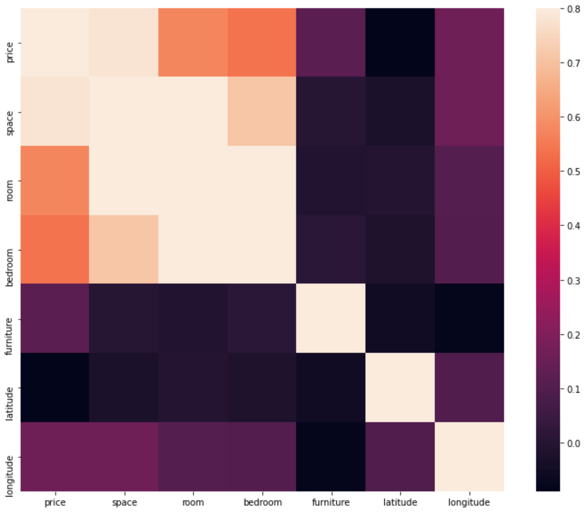
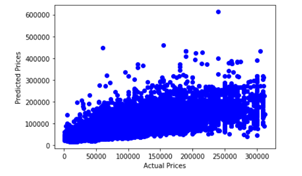

# CS4641 Final Report: House Price Predictor

## Team Members

- Meena Ajith
- Srajan Sunil Dube
- Roshen Jegajeevan
- Nilesh Manivannan
- Austin Peng

## Introduction/Background

Various factors affect the prices of houses in any location. Without a proper way to determine the effect of those factors, it is impossible to find out the best time to purchase a house, which is obviously at the lowest value possible within a specific time frame. Many studies analyzed housing factors and long-term changes. However, these studies have been completed mainly in the US and Europe, examining developed countries in a capitalistic economy. Our project will aim to analyze the housing market of an untapped area such as Georgia (the country, not the state). Georgia ranks 100th in GDP per capita and is a developing country, but still has one of the most capitalistic societies in the world. Looking at the housing market in this country would allow us to gain new information that we couldn’t attain by doing the same repetitive analysis on Western countries. This machine learning analysis would yield both better predictive capability and detailed insight into a potentially untapped market.

## Problem Definition

- What factors affect the housing market in Georgia?
- How could we best predict the prices given features such as square footage, number of rooms, number of bedrooms, and whether the house is furnished.

## Data Collection

We performed the data collection through an analysis of different Eastern countries and their housing markets. We decided on Georgia after finding a housing dataset on Kaggle that had all the features we wanted to analyze. We assessed further datasets from other sources such as DataWorld, Redfin, and Zillow but decided to proceed further with Kaggle as there weren't significant amounts of housing information on Georgia.

## Methods

Preprocessing was completely changed during the final segment of our project. We realized the initial changes in the dataset did not have a significant impact on the final calculations so we imposed harsher restrictions on the data. We first dropped and replaced nulls, as well as removed duplicate columns and data. Our dataset included data from a wide range of areas around Tbilisi. In order to keep our dataset more consistent, we set a range requiring the houses to be within the specified urban area of Tbilisi, the capital of Georgia. We continued by extracting more information from the description of each house listing. We parsed it for the number of rooms and the number of bedrooms. At the end of preprocessing, we had a total of 7 features, price, space, number of rooms, number of bedrooms, whether the listing was furnished, latitude, and longitude. As a sanity check, we also created a heatmap showing the correlations between each feature. A correlation of 1 means the features are greatly correlated while a correlation of 0 means the features are not correlated.

Now, we were able to proceed with principal component analysis (PCA) and use dimensionality reduction to keep only the essential features and speed up calculations in the testing phase of the analysis. We achieved a PCA feature retention value of 69.376%. 

After dimensionality reduction and understanding which features would be the most effective in the analysis, we decided to use 6 different models to examine our data. We started with four different machine learning models: ridge regression, lasso regression, linear regression, and random forest classifier. These were the four models that we thought were best for our data since we wanted to continuously predict house prices given certain features. By approaching the data from different angles, we can understand which technique would be able to utilize the correlations within the data and select the model which has the best predictive capability. With extra time, we also implemented a neural network and k-means clustering to examine other models and their effects on the data. We did this to attain a more holistic approach through non-regression techniques.

## Final Results And Discussion
### Linear Regression Results

We started with linear regression to see if we can find a direct correlation between one or some of our features to the house prices. We ran the linear regression model on the features generated by PCA and output the R-squared and MSE values. We chose R-squared as it is a good representation of accuracy and we chose MSE to tell us the error in our model.

The R squared value we obtained was .4711848766 which means there is a low correlation between the predicted values and the true values. We also got an MSE of 2.10087e-05 which is very good. 

The plot above shows the actual prices vs the predicted prices with a line of best fit.

The R-squared value was not where we wanted it to be. This could be due to many reasons as linear regression just analyzes the linearity between an independent and dependent variable. Even after all the data processing, we failed to find any linearity between our features and the house prices. The data may not have been linear and some form of polynomial regression may have been a better fit for the data, which is why we received such a low accuracy. In addition to this, we were also losing a lot of our data when we ran PCA. The lesser amount of data could also have been a reason why we received such a low accuracy. 

### Lasso And Ridge Regression Results

After running linear regression on our data, we decided to test ridge and lasso regression as well to see how it responded to L1 and L2 regularization. Regularization helps simplify the model by essentially eliminating unnecessary or unrelated parameters. We predicted that these models would improve our accuracy and wanted to see whether L1 or L2 would yield better results for our data.

Our Lasso regression analysis provided the following results:
- R squared value was 0.638180806 which means there is a moderate correlation between the predicted values and the true values.
- MSE value of 1.4020523e-05

Lasso regression had a much better but still not adequate R-squared value. After an analysis, we came up with a few different reasons this could be the case. Lasso regression utilizes L1 regularization, or shrinkage, resulting in more sparse models with fewer parameters. Regularization helps us avoid overfitting if there is too much background noise or if our model isn’t able to analyze the data properly. L1 regularization is preferred when there are a high amount of features being utilized in our analysis. Since we already started with a small number of features in our dataset, there was likely not enough information to lead to a drastic improvement from linear regression. However, with the limited features, we were able to get quite a large improvement in accuracy compared to linear regression.

Our Ridge regression provided the following results:
- R squared value was 0.67642736 which means there is a moderate correlation between the predicted values and the true values.
- MSE value of 1.40204775e-05

Ridge regression utilizes L2 regularization by constricting coefficients rather than shrinking them to 0 like lasso regression. This allows all the features to be used while maintaining strict penalties. We also extended our regression by constructing polynomial features from the data. Usually, L2 regularization is more accurate than L1 at a higher computational cost, and the difference was seen here since the R^2 value for ridge regression was slightly higher than lasso regression. Similar to L1 regression though, we did not have enough features to make a drastic difference in accuracy but were still able to see a significant difference when compared to linear regression.

Lasso regression and ridge regression performed much better than linear regression on our data. Clearly, the regularization made quite a large difference in the results as it must have cut out unnecessary features and thus found a better correlation. The best way to improve our accuracy with these models would be to increase the size of our data by increasing the number of features, thus allowing Ridge and Lasso regression to perform better.

### Random Forest Results

The R squared value was .82764377 which means there is a high correlation between the predicted values and the true values.

Random forest works the best when there is highly dimensional data and a large amount of material to work with. One reason random forest may have worked well is because the model is much more robust with outliers and non-linear data and is also able to handle unbalanced data very well. The model also has a low bias and moderate variance. This works exceptionally well with our data which is why we were able to attain such a high R^2 value since it was able to surpass some of the limitations in the other regression techniques.

### K-Means Results
We wanted to examine clustering to see if there were any sections within the data that were actually fit by K-means. We first used the elbow method to plot explained variation by the number of clusters to determine the optimal amount of clusters. The elbow was situated at 3 so we proceeded with 3 clusters. We then performed K-means with 3 clusters.

Clustering seemed to not be an applicable choice as the data is very dense and not separable. Because of this, we decided to proceed with our other models.

### Neural Network Results

Neural networks mimic how a human brain works in order to recognize relationships within large amounts of data. They are especially useful in financial situations where prices must be forecast. This is because the networks can identify certain nonlinear relationships and patterns that simple technical analysis cannot identify. Since our project revolves around predicting housing prices in Georgia, we thought that a neural network would be a good method to use. We initially tried running a convolutional neural network but soon found that it was better suited for classification and problems such as image analysis. We thus defined the following network:

We spent quite a while tuning the parameters and adding/removing layers and found that this layout gave us the best results. We also found that dense layers worked best because we wanted to find the strongest association from a multitude of features to the house price.
By running the above neural network on our cleaned data, we were able to predict prices with a mean absolute percentage error of 30.964% as well as a mean squared logarithmic error loss of 0.1375 as shown below:

We decided to use these two metrics because they were the best representative of our continuous prediction model. The mean absolute percentage error helped measure our accuracy and since it was somewhat low, it tells us that our model was reasonably accurate. The loss value was also low which means our model performed well. Here are graphs of these metrics over time:

These graphs show a clear decrease in both the loss and mean absolute percentage error over time, also indicating that our model was effective.

Here is a graph showing our predicted house prices vs the actual house prices. Clearly, the model worked fairly well in predicting the house prices.

This model provided us with a method that is more accurate than the regression models but not as accurate as the random forest method. Neural networks have a large number of free parameters which gives them the ability to analyze and fit more complex data that the other models could not. However, there are also limitations such as the requirement of large amounts of training data, which we were able to provide to a certain extent. As a result, we were able to utilize this model with decent accuracy.

## Conclusion

Overall, after extensive analysis and testing of 6 different predictive models, random forest and neural networks seem to yield the best results within the data. The other 3 regression models and k-means clustering model weren’t able to fit the data well and had much lower metrics and visualizations due to their model's limitations. However, random forest and neural networks were able to utilize their respective model's robustness and versatility which led them to have the highest predictive capability. Random forest was able to look past outliers and unbalanced data to find correlations that led it to have an R^2 of 0.82764377. Neural networks had the ability to handle much more complex relationships between variables which led us to a mean absolute percentage error of ~32%. 

While some of our results were fairly positive, we could potentially do even better. Our dataset was quite small and we had a limited number of features. Further preprocessing and parsing the house listing's descriptions for more details would add more features to the dataset. The additional features would be incredibly helpful as it would lead to PCA performing much better, and thus linear regression performing better as well. It would also lead to lasso and ridge regression having more data to work with and regularize, thus improving their accuracy as well.

Overall, our analysis of Georgia led us to see which models have the highest capability in a developing country with a still-emerging housing market. The results were surprising but made sense considering the variability and inconsistency in the original dataset. After intensive cleaning, preprocessing, training, and testing, we were finally able to select two models: random forest and neural networks that worked the best with our dataset.

## Timeline
**October**
10/03 ~ 10/09

- Brainstorm and select a topic for the project.
- Do background research and create a timeline for the project.
- Complete project proposal.

10/10 ~ 10/16

- Find data to use and analyze for the model.

10/17 ~ 10/23

- Clean the data and build the dataset.

10/24 ~ 10/30

- Research and decide on the machine learning models to use for the project.

**November**
10/31 ~ 11/06

- Experiment with multiple approaches and incrementally increase	the number of features.

11/07 ~ 11/13

- Continue experimentation and adding features.

11/14 ~ 11/20

- Complete and submit midterm report.

11/21 ~ 11/27

- Test the model and calculate metrics for the model.

**December**

11/28 ~ 12/04

- Begin and complete rough draft of the final report.

12/05 ~ 12/07

- Make last-minute edits to the final report.

## References

Droes, Martijn, and Alex Van de Minne. “Do the Determinants of House Prices Change over Time? Evidence from 200 Years of Transactions Data.” *25th Annual European Real Estate Society Conference*, 2016, https://doi.org/10.15396/eres2016_227.

Grybauskas, Andrius, et al. “Predictive Analytics Using Big Data for the Real Estate Market during the COVID-19 Pandemic.” *Journal of Big Data*, vol. 8, no. 1, 2021, https://doi.org/10.1186/s40537-021-00476-0.

Ho, Winky K.O., et al. “Predicting Property Prices with Machine Learning Algorithms.” *Journal of Property Research*, vol. 38, no. 1, 2020, pp. 48–70., https://doi.org/10.1080/09599916.2020.1832558.

Kahn, James A. “What Drives Housing Prices?” *SSRN Electronic Journal*, 2008, https://doi.org/10.2139/ssrn.1264048. 
